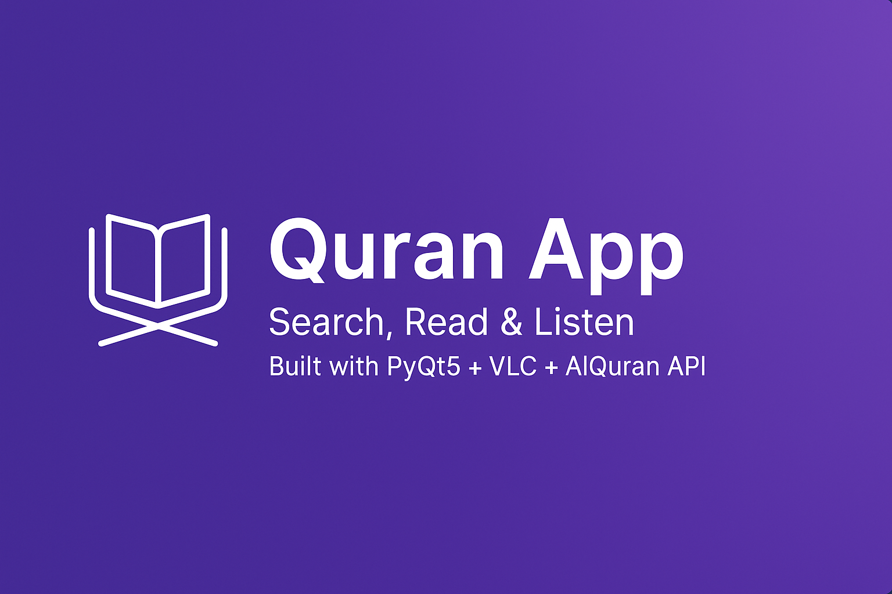
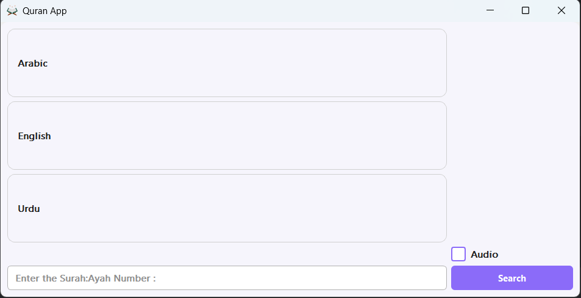

---

<p align="center">
  
</p>

<h1 align="center">🌙 Quran App</h1>

<p align="center">
  A modern desktop Quran application built with <b>Python (PyQt5)</b> and the <b>AlQuran Cloud API</b>.
  <br>
  <i>Search any Surah:Ayah, view translations in Arabic, English, and Urdu, and listen to recitations — all in a beautifully designed, responsive interface.</i>
</p>

---

## ✨ Features

- 🔍 **Search any Ayah** using the `Surah:Ayah` format (e.g., `2:255`)
- 🕌 **Multilingual display:** Arabic • English • Urdu
- 🎧 **Audio playback:** Stream recitations when the “Audio” option is checked
- 🪶 **Modern design:** Soft gradients, rounded widgets, and balanced spacing
- 💾 **Lightweight & Portable:** No global VLC installation required
- 🧱 **Packaged EXE:** Runs as a standalone app built with PyInstaller

---

## 🧠 Technologies Used

| Component | Description |
|------------|-------------|
| **Python** | Core programming language |
| **PyQt5** | GUI framework for the interface |
| **VLC (python-vlc)** | Audio playback library |
| **Requests** | For API calls to [alquran.cloud](https://alquran.cloud/api) |
| **PyInstaller** | Creates standalone `.exe` builds |

---

## 🖼️ Preview

<p align="center">
  
</p>

> *Designed with a minimal purple-white aesthetic, rounded widgets, and balanced spacing for readability.*

---

## ⚙️ Setup Instructions

### 🐍 For Developers

1. **Clone the repository:**
   ```bash
   git clone https://github.com/<yourusername>/QuranApp.git
   cd QuranApp

2. Create and activate a virtual environment:

python -m venv venv
venv\Scripts\activate


3. Install dependencies:

pip install -r requirements.txt


4. Run the app:

python main.py


---

💻 For End Users

If you downloaded the .exe release:

Simply run QuranApp.exe

Keep the VLC_README.txt file beside the .exe

✅ No need to install VLC separately


---

🧰 Build .exe (Optional)

To create a standalone Windows executable:

pyinstaller --noconsole --onefile --icon=quran.ico main.py

Then ensure the VLC_README.txt file remains beside your generated .exe inside the dist/ folder.


---

📦 Requirements

PyQt5
requests
python-vlc


---

📂 Folder Structure

Quran-App/
│
├── main.py
├── README.md
├── requirements.txt
├── quran.ico
│
├── VLC_README.txt
│
├── resources/
│   └── images/
│       └── ui/
│           └── _preview/
│               ├── banner.png
│               └── ui.png
│
└── dist/
    └── QuranApp.exe


---

👨‍💻 Developer

Developed by: Muhammad Hussnain Faraz
📍 BS Computer Science — GCUF Samundri Sub-Campus, Pakistan
💜 Passionate about Islamic software, AI, and open-source development.


---

🕋 Credits

Quran Data API: alquran.cloud

Recitations: Mishary Rashid Alafasy (public access)

Purpose: Built sincerely for the benefit of the Ummah — Fi Sabeelillah.


---

🧿 License

This project is open-source under the MIT License.
Feel free to fork, enhance, and share — for the sake of Allah (سُبْحَانَهُ وَتَعَالَى).


---